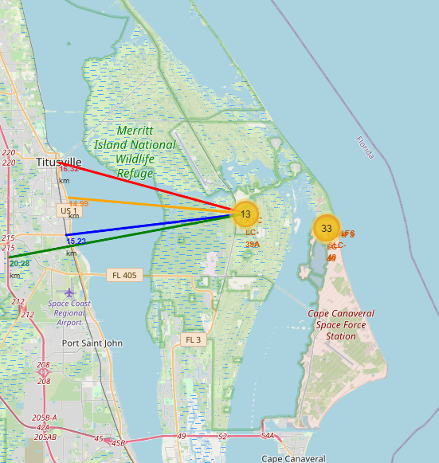

# SpaceX Landing Prediction

This project is based on the 10th and final course of the IBM Data Science Professional Certificate. It summarizes, in the form of a project, almost all the concepts and skills learned throughout the specialization.

In this project, I explore and predict the success of SpaceX rocket landings using data science techniques, machine learning models, and geospatial visualizations.  

---

## Overview

The goal was to understand the factors that contribute to the successful landing of Falcon 9 rockets.  
To accomplish this, I collected data from SpaceX’s public API and Wikipedia, processed and transformed the data, engineered features, and evaluated several classification models.

I also used geospatial visualization to better understand the physical environment of the launch sites and their surrounding infrastructure.

---

## Project Structure

```
data/
├── raw/              # Collected data (API and web)
├── processed/        # Cleaned and transformed data
├── interim/          # Holdout sets for model evaluation

ingest/
├── spacex_api.py
└── scrape_wikipedia.py

models/
├── Trained models and scaler (pkl files)

notebooks/
├── data_wrangling_api.ipynb
├── eda_feature_engineering.ipynb
├── visual_analytics_folium.ipynb
└── model_evaluation.ipynb

src/
└── train_model.py
```

---

## Exploratory Analysis

I started with a thorough exploratory data analysis (EDA), focusing on key features such as launch site, orbit type, booster version, and payload mass.

In the geospatial analysis (Folium), I examined how close launch sites were to coastlines, cities, highways, and railways.

  


---

## Feature Engineering

To prepare the data for modeling, I:

- One-hot encoded categorical features such as Launch Site and Orbit
- Normalized continuous variables like Payload Mass using `StandardScaler`
- Separated holdout test sets for reliable evaluation

---

## Model Training & Evaluation

I trained and evaluated four classification models:

- **Logistic Regression**
- **Support Vector Machine (SVM)**
- **K-Nearest Neighbors (KNN)**
- **Decision Tree**

Each model was assessed using:

- Accuracy
- Precision, Recall, and F1-Score
- Confusion Matrix

The training was performed in a Python script for modularity, while model results and insights were explored in a Jupyter Notebook.


---
